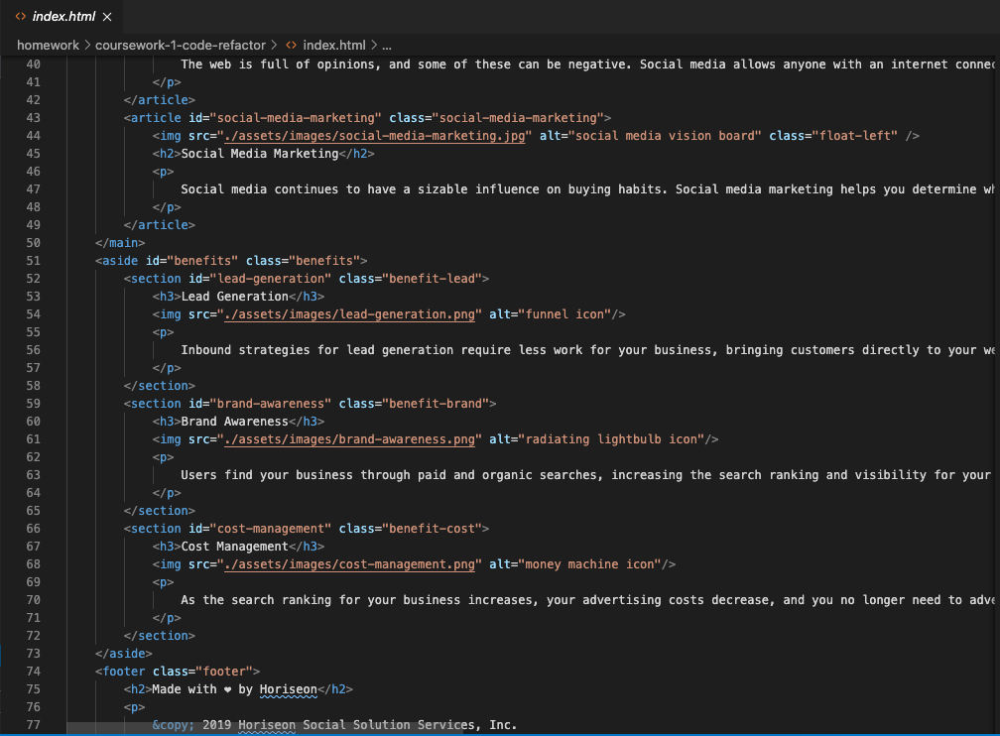
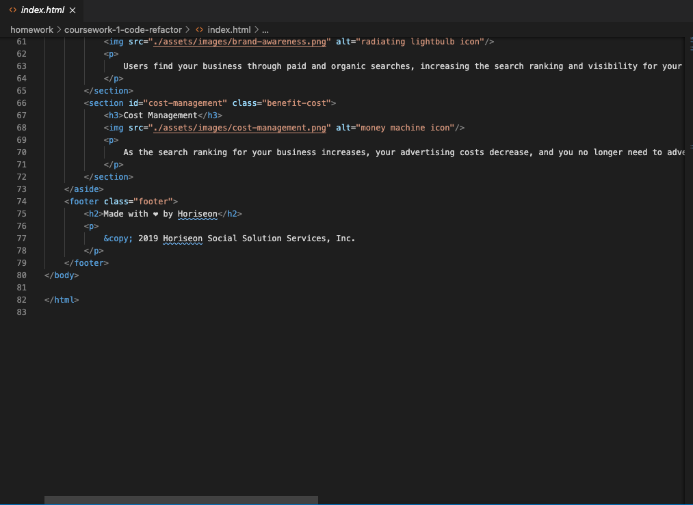

# Coursework-1 Code Refactor

## Description
In this coursework assignment I have improved the accessibility of Horiseon marketing agency's landing page by adding semantics HTML elements and descriptive alt and id attributes where applicable.

To improve the code I have fixed navigation errors, added comments to the CSS stylesheet and consolidated the code to follow DRY principles.

The website's code has been uploaded to a unique GitHub repository with descriptive commits and has been deployed via GitHub Pages.

## Link to the Deployed Application

 https://ivnkris.github.io/coursework-1-code-refactor/

 ## Link to the GitHub Repository

 https://github.com/ivnkris/coursework-1-code-refactor

 ## Screenshots

